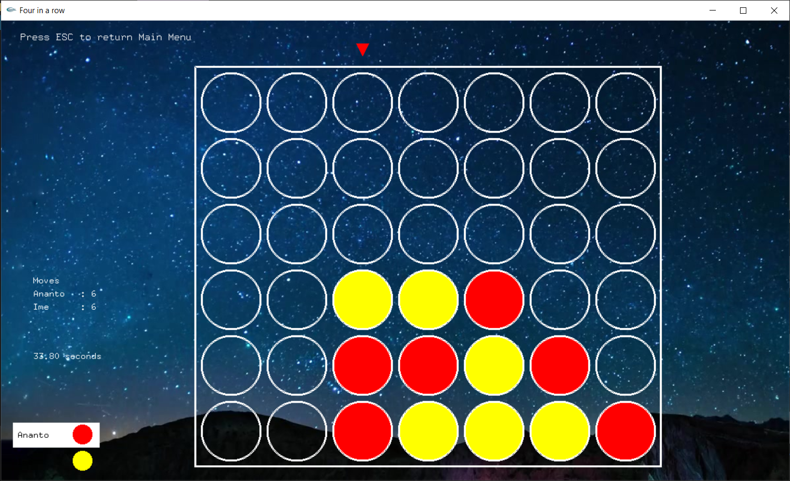
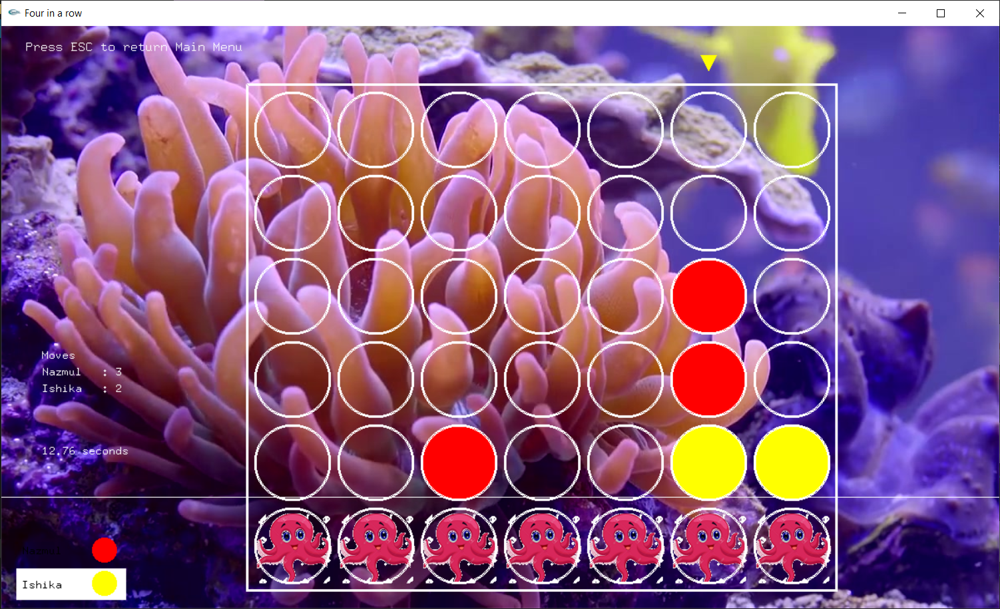
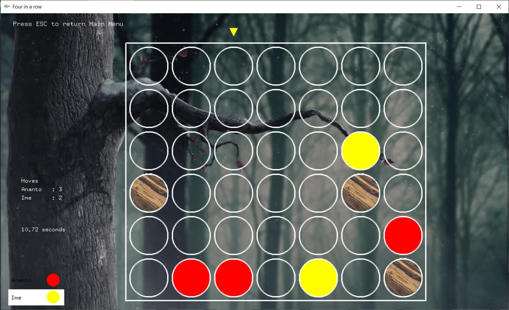
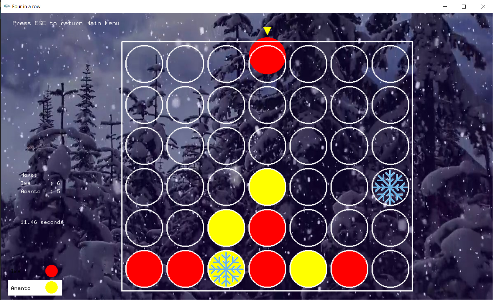
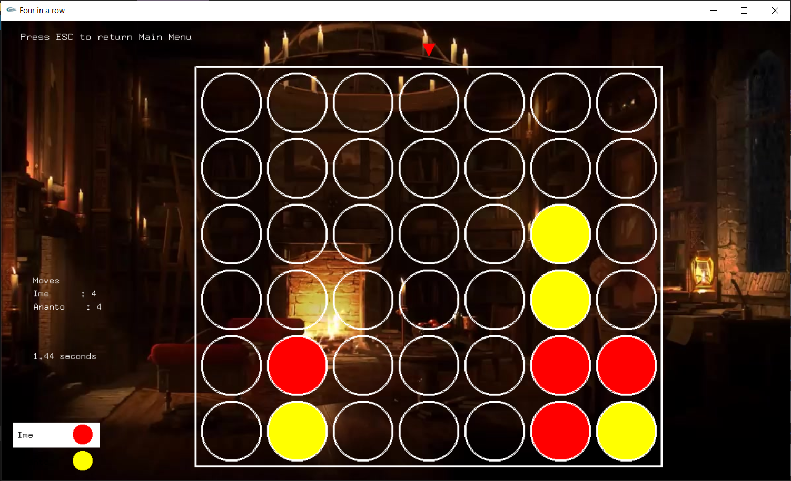

# Four In A Row  

A 2D Abstract Strategy Game made in C/C++  

## Plug and Play  

download this repository as ZIP or clone it to your local machine and RUN the _Four_In_A_Row.exe file. You're good to go.  

## Game Modes

This is a two player game where each of the player try to get four of there buttons in a line.  

The game starts with a board having 6x7 holes. Players put there buttons from the top of the board and it gets down until there's another button or it's the end of the column. The 1st player gets to play with red buttons and the 2nd one gets yellow ones.  

Now, one of the players win if they can get four of there buttons in a horizontal, vertical or diagonal line before the other one does.  

Let's check out the modes ~  

1. This is the basic mode where things stated above are going to happen only, no extra surprise!   

2. The game has to be finished in a certain amount of time. There'll be a level sliding upward and once it gets passed a whole row of the holes, all the buttons of both of the players will move one row higher. Thus, the game will end when the level crosses the whole board or one of the two players win.  

3. There's going to be some blocks in some of the holes. Buttons cannot pass them and will stuck over them. So, players will certainly not have all of the board to play and that's whay have to use there vision in order to win.  

4. The game is so simple and normal but don't blame me if some of the buttons get freezed all of a sudden!  

5. Aaron and Julian are playing Four In A Row in this wonderful evening. Let's see who wins!  

## Requirements  

Platform : Windows only  
Ram : No specific requirement (4GB recommended)  
CPU : No specific requirement  

##  

*In order to get the source file, contact me through mail : nazmulislamananto@gmail.com*
